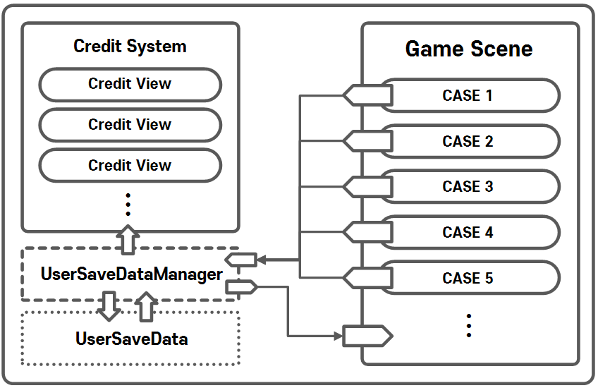

# CreditSystem

**게임 속에 존재하는 Credit(재화) 들을 관리하는 시스템입니다.**

- CreditSystem Version 1.0 (2023.08.29)

## CreditSystem Version 1.0

### 기능

- [UserSaveData]의 [Credit Data]와 [Credit UI]연동

### 설계의도

- **게임 속 [Credit System]을 관리하는 주체는 1개**
- **특정 게임 씬에 종속되지 않고 사용 가능** 
- **[UserSaveDataManager]의 Credit 관련 함수 사용 시 반응**

### 구조도

    

### 코드 링크

  - **[Credit System](https://github.com/MinjunISAAC/CreditSystem/blob/main/CreditSystem/Assets/Utility/CreditSystem/Scripts/CreditSystem.cs)**
  - **[Credit Hud View](https://github.com/MinjunISAAC/CreditSystem/blob/main/CreditSystem/Assets/Utility/CreditSystem/Scripts/CreditHudView.cs)**
  - **[UserSaveDataManager](https://github.com/MinjunISAAC/CreditSystem/blob/main/CreditSystem/Assets/Utility/UserSaveData/Scripts/UserSaveDataManager.cs)**
  - **[UserSaveData](https://github.com/MinjunISAAC/CreditSystem/blob/main/CreditSystem/Assets/Utility/UserSaveData/Scripts/UserSaveData.cs)**

### 수정 내역

| 수정 날짜 | 수정 내용           | 진행 상황   | 버전 | 
|-----------|--------------------| ------------ | -----|
|2023.08.29 | 첫 번째 버전 업로드  | 완료         | 1.0  |
|2023.08.30 | 해상도 대응          | 완료         | 1.1  |
|2023.08.30 | 획득 효과 기능 추가  | 완료         | 1.1  |
